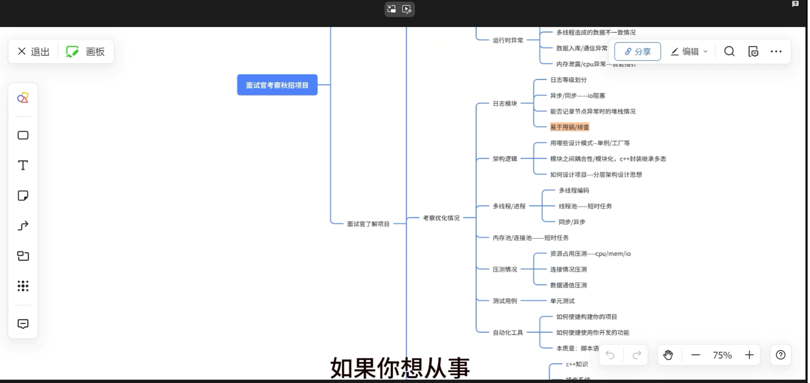
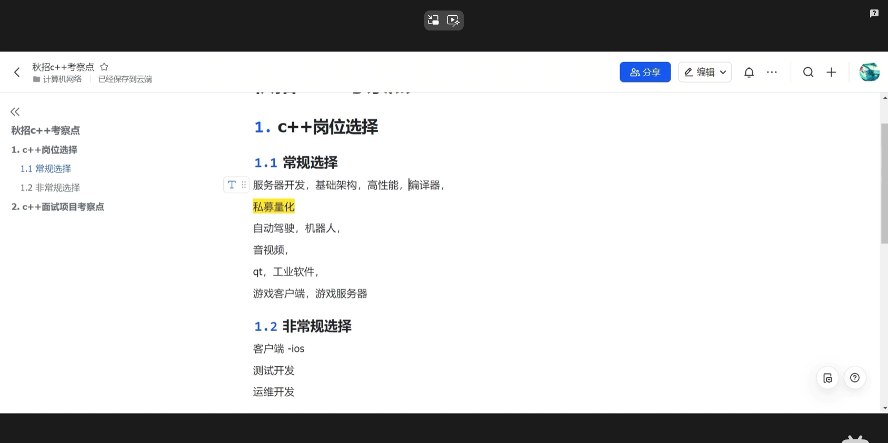

# 一级标题

## 项目出发点是什么

为了实时检测负载，cpu使用率，内存等状态，进而排查异常情况，且相对于top等系统命令，可视化程度更高，且能够详细显示多个核心的负载，便于分析

## 项目亮点

1. 分布式监控
2. monitor模块使用到了c++的特性

## 可能的问题

1. grpc模块：grpc底层原理，tcp，udp等计算机网络和网络编程相关知识
2. protobuf模块：protobuf序列化协议底层原理，和xml，jason相比的优缺点；基本使用
3.

## 项目难点或者遇到的问题

### 内存泄漏问题

使用new申请的内存，没有delete掉，后面改用智能指针，方便管理

### gdb调试 

### docker遇到的问题

1. 项目构建时，需要安装开源的库，如grpc，proto，但是在源码构建时遇到很多错误，如缺少依赖库，源码构建时环境变量的设置，需要查看官方文档（如何使用cmake构建）的安装方法，以及根据报错查找解决方法
2. dockerfile的编写；在dockerfile build过程中，需要一步步进行添加，多个库之间有依赖关系，所以经常遇到缺少依赖库的情况，然后我查看官方文档，搜索所依赖的库进行安装，然后我在前面安装所依赖的库，但是本来docker file的构建就很慢，然后缺少依赖库的情况经常出现，需要不断的添加dockerfile代码然后重新构建，就导致构建过程很耗费时间，后来我在出错位置的前一行安装依赖库，那么之前已经构建好的就不用重新构建，缩短了构建的时间，当然这是在调试阶段，在成功构建后，重新整合了docker file的编写顺序，最后成功构建了镜像。
3. 刚开始构建镜像文件时，文件过大，需要压缩镜像文件大小，在proto库和grpc库的安装脚本中，安装完毕后删除解压缩的包。
4. 在docker file中，会将本地目录下的proto，grpc安装包及脚本拷贝到镜像目录下，然后运行安装脚本，因此在安装脚本中需要切换目录到镜像文件目录下proto所在目录
5. 运行容器时，docker run 中环境变量的设置，这里需要添加许多环境变量，否则很多功能无法使用，比如如果想使用qt，就要添加display变量，这些也都是通过报错，然后搜索报错信息，参考别人的解决方法进行解决的

### grpc、proto遇到的问题

1. grpc的使用，在GitHub找到grpc的代码仓库，根据提供的例程学习如何使用grpc，源码学习的困难
2. 编写grpc的server端和client端时，遇到很多问题，主要参考官方给定例程及其他人的解决方法修改代码，
3. client与server功能验证的困难， 编写完成过先用netstat -tap指令测试server端与client端的功能是否正常，先不要把client生成库，生成可执行程序，如何启动client和server，发生一些数据判断通信是否正常
4. 官方给的例程中proto编译工具不是cmake，是bzael，因此需要学习用cmake编译构建proto文件，编写cmakelist时需要不断试错，根据错误完善cmakelist，比如说编译时需要链接grpc的库，但是报错是没有找到gpc的库，后面查找发现需要先find_package到grpc的包，才能链接grpc的库
5. 如何书写proto文件中数据结构，比如有的成员需要使用repeated关键字，并且需要把书写的数据结构整合到一起
6. 如何书写proto文件中的服务，和一些接口

### grpc遇到的问题

1. grpc的使用，在GitHub找到grpc的代码仓库，根据提供的例程学习如何使用grpc

### qt遇到的问题

1. 在设计QT界面时，主函数内刚开始使用thead->join（）阻塞地等待线程，而无法继续执行app.exec()，进而导致错误，后续查阅资料后采用thread->detach()实行线程分离，问题解决
2. 在设计QT界面时，如果想使用信号槽，需要添加Q_OBJECT,同时编译时要添加`set_target_properties(display PROPERTIES AUTOMOC TRUE)`， 否则会报错

## docker模块

1. 容器是如何实现的，底层技术是什么？
   容器的底层原理是namespace和cgroup，他们是linux的内核功能。容器可以利用namespace实现容器之间以及容器与主机之间的资源隔离，比如进程，文件系统，网络等。利用cgroup技术实现对容器内的资源进行分配和限制，比如内存，cpu资源，防止耗尽资源影响到其他容器和主机。

## monitor模块

1. 为什么要进行性能分析，为什么要看cpu的负载情况？
   答：在后端开发中，要关注负载的变化趋势，一旦负载过高，就可能导致进程响应变慢，进而影响服务的正常功能。使用top命令可以查看当前负载，而将负载信息记录下来，可以更好的结合历史数据进行分析和调查
2. 平均负载和CPU使用率之间的关系
   答：平均负载是指单位时间内，处于运行状态和不可中断状态的进程数，这里的进程包括使用cpu的进程，等待cpu的进程，等待IO的进程，而 CPU 使用率，是单位时间内 CPU 繁忙情况的统计，跟平均负载并不一定完全对应。比如：CPU 密集型进程，使用大量 CPU 会导致平均负载升高，此时这两者是一致的；I/O 密集型进程，等待 I/O 也会导致平均负载升高，但 CPU 使用率不一定很高；大量等待 CPU 的进程调度也会导致平均负载升高，此时的 CPU 使用率也会比较高
3. 关于中断，什么是硬中断，什么是软中断，上半部，下半部
   答：①中断是一种异步处理事件的机制，当cpu执行程序时，发生了一件需要立即处理的事件，cpu会暂停程序转而处理事件，执行结束后返回继续执行程序。
   ②当中断发生时，通常会屏蔽其他中断，因此为了不丢失其他中断，需要中断服务程序快速执行，占用较少的cpu时间
   ③由此，Linux将中断分为上半部和下半部，上半部执行需要立即执行的操作，代码运行在中断上下文，执行时间较短，通常是处理硬件的请求，因此称为硬中断；下半部特点就是延迟执行，是对上半部的后续处理，由内核触发，代码运行在内核，因此被称为软中断，但软中断不仅仅指的是下半部，由内核自定义触发的事件也称为软中断
4. cpu使用满了如何排查
   答：从cpu load，cpu stat，cpu softirq方面

## 考察秋招项目及岗位选择

